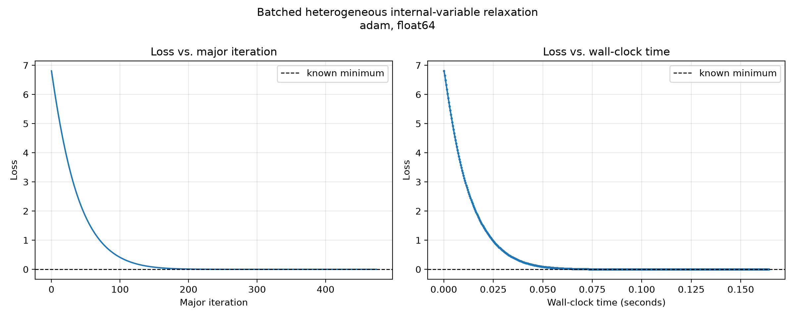
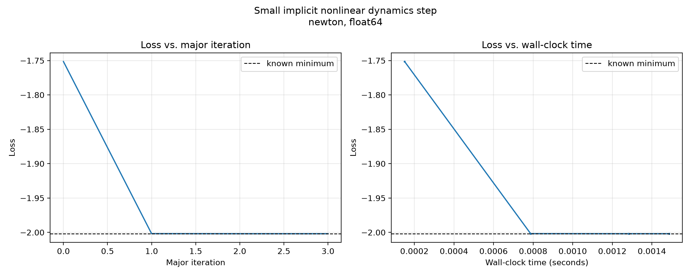
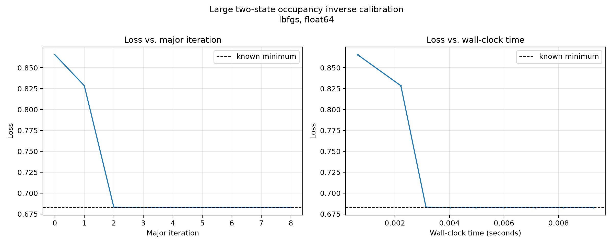
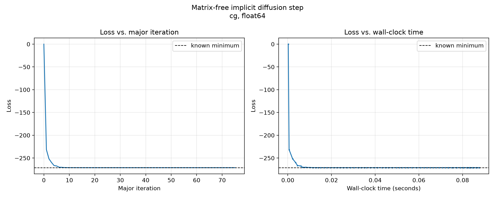
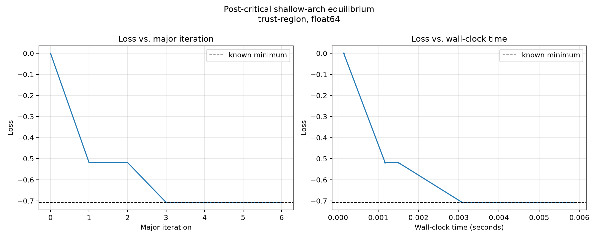

# Optimization for Physical Modeling and Simulation

## Implementation audit

I checked all five objectives against the assignment equations and completed
the benchmark policy and optimizer selection code. The implemented objectives
are:

1. **Batched relaxation:** the mean of the stiffness-weighted quadratic and
   quartic mismatch energies.
2. **Implicit dynamics:** inertial displacement from the predictor, grounding
   and fixed-end bond energies, onsite and bond hardening, and external work.
3. **Occupancy inversion:** mean softplus normalization, the negative supplied
   linear contribution, quadratic regularization, and the fixed energy offset.
4. **Implicit diffusion:**
   $\frac12\lVert u\rVert^2+\frac r2\lVert Du\rVert^2-b^Tu$, where $D$
   includes both homogeneous fixed endpoints. This is equivalent to
   $\frac12u^T(I+rL)u-b^Tu$.
5. **Shallow arch:** the nonconvex energy
   $-\frac\mu2a^2+\frac14a^4+ha+\frac k2(b-ca)^2$.

The source tree has no remaining `STUDENT TODO` implementation markers. The
five full-size nominal solutions agree with their supplied known minima to
approximately $10^{-11}$ or better, which provides an additional end-to-end
check of the objective formulas.

## Experimental setup

I used the full-size cases on the CPU in float64, prepared mode, with one
warmup and five measured repetitions for every nominal and robustness start:

```bash
.venv/bin/python benchmarks/run_principled_physics_benchmark.py \
  --size full --repeats 5 --warmups 1 \
  --backend cpu --dtype float64 \
  --output-dir benchmark-results/full-cpu-float64
```

The warmup removes JAX tracing and compilation from the measured repetitions.
The recorder stores major-iteration history, work counters, final statistics,
and real objective-evaluation timestamps. Each wall-clock plot matches the
loss at a major iteration to the timestamp at which that loss was evaluated.
Consequently, its horizontal spacing is measured rather than estimated.

## Optimizer and hyperparameter choices

| Problem | Choice | Hyperparameters | Reasoning |
|---|---|---|---|
| Batched relaxation | Adam | learning rate `0.01`, `max_iter=2000`, `gtol=1e-6` | The cells are separable but their stiffnesses span a condition number of $10^4$. Adam's coordinate-wise scaling handles this heterogeneity without constructing a Hessian. The conservative learning rate was stable from all four starts. |
| Implicit dynamics | Newton | `max_iter=50`, `gtol=1e-8`, damping `1e-8` | This is a smooth problem with only eight unknowns. Forming and solving with the Hessian is inexpensive, while the quadratic and positive quartic terms give useful curvature. Small damping protects the linear solve. |
| Occupancy inversion | L-BFGS | `max_iter=100`, `gtol=1e-7`, history size `10` | The regularized softplus objective is smooth and convex, but the full case has 128 variables and 16,384 observations. L-BFGS uses curvature information without storing or factoring a dense Hessian. |
| Implicit diffusion | nonlinear CG | `max_iter=200`, `gtol=1e-6`, PR+, strong-Wolfe line search | The objective is an SPD quadratic with a matrix-free nearest-neighbor operator. CG needs only gradients and vector operations, so it preserves the sparse/matrix-free structure. PR+ supplies safe restarts. |
| Shallow arch | trust region | `max_iter=100`, `gtol=1e-8`, initial radius `1.0` | The flat state is unstable and the energy is nonconvex. A trust-region method can control steps when the local curvature is indefinite and safely move toward the snapped equilibrium. |

These settings were checked on the nominal start and every supplied robustness
start. Adam has a larger iteration budget because it makes inexpensive
first-order steps. The second-order and quasi-Newton methods need far fewer
major iterations.

## Results

| Problem | Method | Nominal iterations | Final loss | Known minimum | Final gradient norm | Measured success | Mean time over all starts |
|---|---|---:|---:|---:|---:|---:|---:|
| Batched relaxation | Adam | 474 | 9.236e-12 | 0 | 9.518e-7 | 20/20 | 0.1880 s |
| Implicit dynamics | Newton | 3 | -2.0019886265 | -2.0019886265 | 2.827e-11 | 20/20 | 0.00185 s |
| Occupancy inversion | L-BFGS | 8 | 0.6827754953 | 0.6827754953 | 2.463e-8 | 20/20 | 0.00945 s |
| Implicit diffusion | nonlinear CG | 75 | -271.1584175254 | -271.1584175254 | 2.069e-6 | 20/20 | 0.1639 s |
| Shallow arch | trust region | 6 | -0.7073999639 | -0.7073999639 | 4.002e-10 | 25/25 | 0.00610 s |

The diffusion run stopped by the step tolerance after reaching an objective
gap of $4.55\times10^{-13}$. Its 75 major iterations required 536 objective
and gradient evaluations because the strong-Wolfe line search tests multiple
trial steps. The arch run used 17 Hessian-vector products and rejected one
trial step before converging. These work differences help explain the timing
behavior.

## Convergence plots

Each left panel shows loss against major, non-line-search iteration. Each right
panel shows the same major-iterate losses against measured wall-clock time. The
dashed line is the supplied known minimum.

### Batched heterogeneous relaxation — Adam



### Implicit nonlinear dynamics — Newton



### Occupancy inversion — L-BFGS



### Implicit diffusion — nonlinear CG



### Shallow arch — trust region



## Why wall-clock time is not linear in iteration count

A major iteration does not have a fixed amount of work. A line-search method
may evaluate several trial step lengths before accepting one. Newton may spend
different amounts of work in damping and factorization, while the trust-region
method may use a different number of inner conjugate-gradient iterations and
Hessian-vector products. JAX execution is asynchronous, and operating-system
scheduling and memory effects also introduce small timing variations. The
benchmark therefore synchronizes every result and records timestamps during
the solve rather than multiplying iteration number by an average time.

The JSON logs retain all repetitions, robustness starts, histories, work
counters, and raw objective-evaluation timestamps. The iteration and wall-time
CSV files beside each PNG contain the plotted data.


**AI Usage:** ChatGPT Sol 5.6 was used to verify the mathematical equations I wrote for the objective function. It was also used to suggest optimizer and hyperparameters, and to help with this writeup. 