# Preconditioned Nonlinear Conjugate Gradient

## 1. Method and implementation

I completed a preconditioned nonlinear conjugate-gradient solver using the
Polak–Ribière update. If

$$
g_k = \nabla f(x_k), \qquad z_k = M_k^{-1}g_k,
$$

then the preconditioned Polak–Ribière coefficient used by the implementation is

$$
\beta_{k+1}^{\mathrm{PR}}
=
\frac{z_{k+1}^{T}(g_{k+1}-g_k)}{g_k^{T}z_k}.
$$

The default solver uses the PR+ safeguard

$$
\beta_{k+1}^{\mathrm{PR+}}
=\max\left(\beta_{k+1}^{\mathrm{PR}},0\right),
$$

and updates the search direction using

$$
p_{k+1}=-z_{k+1}+\beta_{k+1}p_k.
$$

If the denominator is too small or nonfinite, the implementation sets
$\beta=0$, which restarts the method with a preconditioned steepest-descent
step. The solver also restarts if the proposed direction is not a descent
direction. Step lengths are selected using a strong-Wolfe line search.

I implemented the following three preconditioners:

1. **Identity:** $z=g$. This is ordinary nonlinear conjugate gradient.
2. **Fixed diagonal:** for $M=\operatorname{diag}(d)$,
   $z_i=g_i/d_i$. A damping floor prevents division by a zero or very small
   diagonal entry.
3. **Jacobi:** the Hessian diagonal is recomputed at the current iterate and
   $z_i=g_i/|H_{ii}(x)|$. Damping and a maximum inverse bound prevent
   unstable scaling.

## 2. Experimental setup

I ran every problem in `STANDARD_PROBLEMS` on the CPU in both supported
precisions. JAX compilation was excluded from the timings by performing one
warm-up solve, and each reported time is the average of five subsequent
solves. The commands were

```bash
.venv/bin/python examples/benchmark.py --device cpu --precision float64 --repeat 5
.venv/bin/python examples/benchmark.py --device cpu --precision float32 --repeat 5
```

The default gradient tolerances were used. Most problems used $10^{-5}$ in
float64 and $5\times10^{-4}$ in float32. The float32 tolerances for
Freudenstein–Roth and Brown badly scaled were $5\times10^{-2}$ and
$2\times10^{-2}$, respectively, because of their numerical scales.

### Float64 results

| Problem | Preconditioner | Status | Iterations | Function evaluations | Final objective | Final $\lVert g\rVert_\infty$ |
|---|---|---:|---:|---:|---:|---:|
| Rosenbrock (2D) | Fixed initial Hessian diagonal | Converged | 26 | 181 | 8.197e-13 | 1.620e-06 |
| Extended Rosenbrock (10D) | Fixed initial Hessian diagonal | Converged | 142 | 576 | 2.429e-11 | 7.901e-06 |
| Powell singular (4D) | Identity | Converged | 50 | 261 | 1.880e-08 | 6.947e-06 |
| Beale (2D) | Jacobi | Converged | 14 | 71 | 6.571e-12 | 4.736e-06 |
| Wood (4D) | Identity | Converged | 81 | 387 | 4.169e-11 | 5.097e-06 |
| Freudenstein–Roth (2D) | Jacobi | Converged | 15 | 72 | 4.898e+01 | 1.479e-06 |
| Brown badly scaled (2D) | Jacobi | Converged | 14 | 36 | 2.314e-25 | 9.620e-07 |

The nonzero Freudenstein–Roth objective is expected. From the standard starting
point, the solver reaches the known local minimizer whose objective is about
48.9843.

### Float32 results

| Problem | Preconditioner | Status | Iterations | Function evaluations | Final objective | Final $\lVert g\rVert_\infty$ |
|---|---|---:|---:|---:|---:|---:|
| Rosenbrock (2D) | Fixed initial Hessian diagonal | Converged | 181 | 844 | 1.011e-07 | 4.523e-04 |
| Extended Rosenbrock (10D) | Fixed initial Hessian diagonal | Line search failed | 1042 | 4333 | 9.846e-07 | 1.011e-03 |
| Powell singular (4D) | Identity | Converged | 43 | 192 | 5.302e-06 | 4.864e-04 |
| Beale (2D) | Jacobi | Converged | 10 | 42 | 2.623e-09 | 3.494e-04 |
| Wood (4D) | Identity | Converged | 83 | 397 | 1.683e-07 | 4.341e-04 |
| Freudenstein–Roth (2D) | Jacobi | Converged | 10 | 46 | 4.898e+01 | 4.983e-02 |
| Brown badly scaled (2D) | Jacobi | Converged | 12 | 32 | 2.550e-17 | 1.010e-02 |

## 3. Choice of preconditioner
**AI Usage Note**: I used ChatGPT 5.6 Sol to understand these different problems as I hadn't seen them previously. I started with identity, then diagonal and then hessian diagonal preconditioning for each problem. Once the initial run was over, I used ChatGPT to suggest apprporiate preconditioner based on problem attributes. 

| Problem | Choice | Reason |
|---|---|---|
| Rosenbrock (2D) | Fixed initial Hessian diagonal | Rosenbrock has a narrow, curved valley with very different curvature in different coordinate directions. Scaling by the initial Hessian diagonal reduces this imbalance. Keeping the diagonal fixed gives a stable positive metric for the conjugate-gradient update. |
| Extended Rosenbrock (10D) | Fixed initial Hessian diagonal | The extended problem contains the same badly scaled valley structure in more variables, so the same curvature scaling is useful. Absolute values and damping keep the diagonal positive and safe to divide by. |
| Powell singular (4D) | Identity | The Hessian becomes singular at the minimizer, so a Hessian-diagonal inverse can become excessively large as curvature approaches zero. Identity scaling was stable and converged in both precisions. |
| Beale (2D) | Jacobi | Beale has position-dependent and unequal curvature. Recomputing the Hessian diagonal adapts the scaling as the iterate moves and produced fast convergence. |
| Wood (4D) | Identity | Wood contains strong coupling between variables. A diagonal approximation does not represent these off-diagonal interactions well and can distort the direction. Identity scaling was the more reliable simple choice. |
| Freudenstein–Roth (2D) | Jacobi | Its nonlinear residuals produce curvature that changes with position. The dynamic diagonal gives useful local scaling and quickly reaches the local minimizer associated with the standard starting point. |
| Brown badly scaled (2D) | Jacobi | The solution components have drastically different magnitudes, approximately $10^6$ and $10^{-6}$. Dynamic curvature scaling directly addresses this poor scaling and gave convergence in 12–14 iterations. |

These choices are based on the structure of each objective and on experimental
behavior. The Jacobi implementation uses
`absolute=True`, a damping floor of $10^{-6}$, and a maximum inverse of
$10^6$. These safeguards matter when a Hessian diagonal entry is negative,
zero, or very small.

The separate ill-conditioned diagonal quadratic makes the effect of
preconditioning especially clear. In float64, identity scaling reached the
3000-iteration limit with objective 185, while the exact fixed-diagonal
preconditioner converged in one iteration. In float32, identity scaling failed
during the first line search, while the diagonal preconditioner converged in
two iterations. For a quadratic with Hessian $D$, using $M=D$ transforms
the preconditioned gradient to $D^{-1}Dx=x$, eliminating the coordinate
scaling caused by the condition number.

## 4. Effect of float32 versus float64

The two precisions behaved differently, most clearly on the Rosenbrock
problems. The 2D problem required 26 iterations in float64 but 181 in float32.
The 10D problem converged in 142 iterations in float64, whereas the float32 run
made substantial progress but eventually stopped when the strong-Wolfe line
search failed. Its final objective was already small, $9.846\times10^{-7}$,
but its gradient norm, $1.011\times10^{-3}$, was still larger than the
$5\times10^{-4}$ tolerance.

Float32 has about seven significant decimal digits, compared with roughly
sixteen for float64. Near a minimizer, the line search compares small changes
in objective values and directional derivatives. Rounding and cancellation can
make the Armijo and curvature tests harder to satisfy reliably, especially in
a narrow, poorly conditioned Rosenbrock valley. The computed conjugacy and
curvature information also become less accurate after many iterations. This
explains the longer float32 Rosenbrock run and its eventual line-search
failure.

Several float32 runs took fewer iterations than their float64 counterparts,
including Powell, Beale, Freudenstein–Roth, and Brown badly scaled. This should
not be interpreted as float32 finding a more accurate solution. The float32
runs intentionally use looser gradient tolerances, so they are allowed to stop
earlier. Their final objective values and gradient norms are correspondingly
less accurate. Float64 was the more reliable choice when high accuracy was
required.

## 5. GPU parallelization and the primary bottleneck

There are good opportunities to use `vmap` when many independent problems have
the same objective and array shapes. Examples include multiple starting points,
a parameter sweep, repeated problems with different data, or a batch of
diagonal quadratics. The repository's `make_batched_solver` follows this idea:
it applies `vmap` to independent solves, allowing JAX to execute their array
operations in parallel on a GPU.

A single nonlinear-CG trajectory cannot be parallelized across optimization
iterations because iteration $k+1$ depends on the point, gradient, and search
direction produced by iteration $k$. The trial points inside the current
strong-Wolfe implementation are also chosen adaptively, so those line-search
steps are sequential. The heterogeneous standard problems cannot all be put in
one simple `vmap`, since they use different objective functions and dimensions,
although batches can be made separately for each problem.

The primary bottleneck is repeated objective and gradient evaluation inside
the strong-Wolfe line search. For example, the float32 10D Rosenbrock run used
4333 function/gradient evaluations for 1042 accepted iterations. Automatic
differentiation makes each gradient more expensive than an objective-only
evaluation, and rejected line-search trial points still incur this cost. For
the Jacobi cases, evaluating an exact Hessian diagonal at every accepted point
adds further work.

The supplied test problems contain only 2–10 variables, so a GPU is unlikely
to help a single solve: kernel-launch and dispatch overhead can be larger than
the small amount of arithmetic. GPU execution becomes more attractive for
large-dimensional objectives or large batches of independent solves, where
`vmap` exposes enough parallel work to offset that overhead.

## 6. Convergence plots

Each plot shows objective value against nonlinear-CG iteration. The dashed
horizontal line is the known objective at the relevant minimizer.

### Rosenbrock (2D)

| float64 | float32 |
|---|---|
| 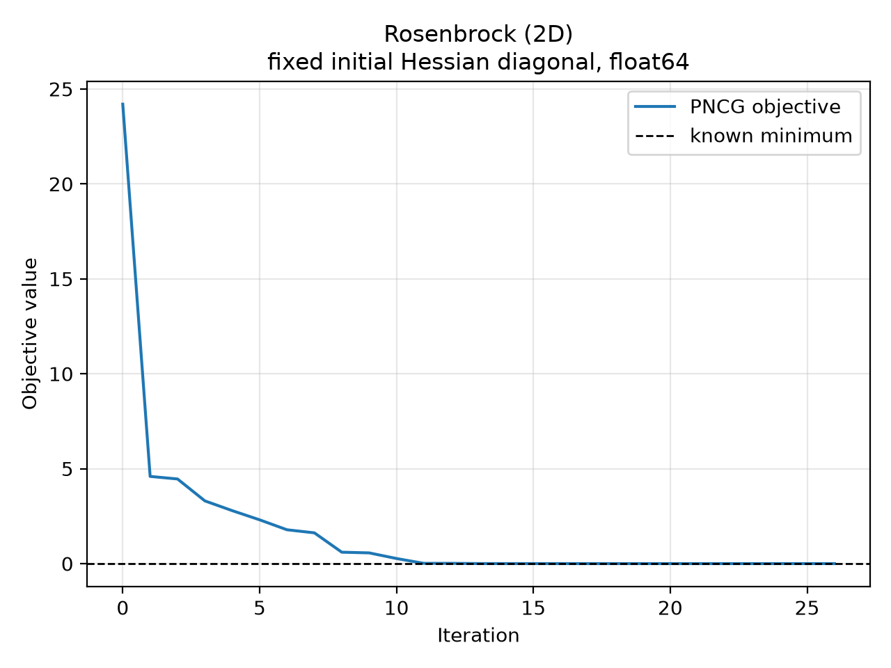 | 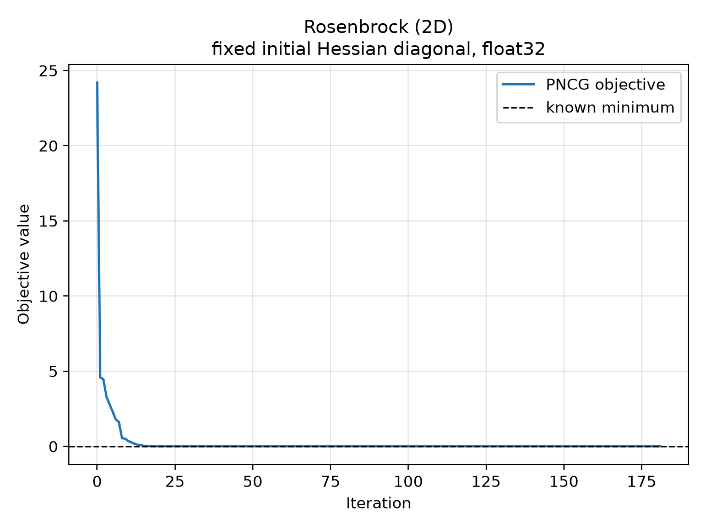 |

### Extended Rosenbrock (10D)

| float64 | float32 |
|---|---|
| 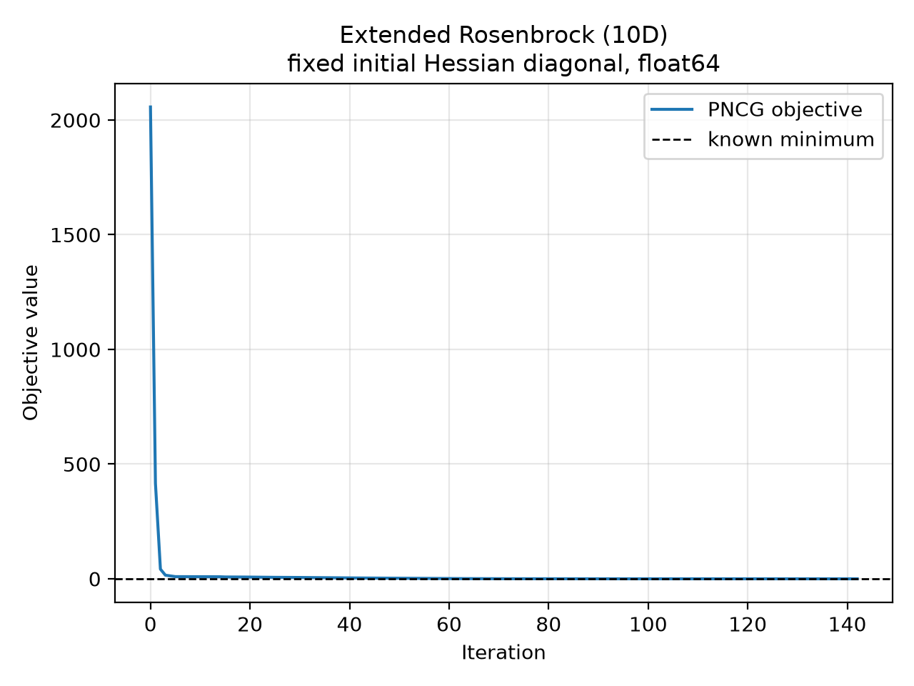 | 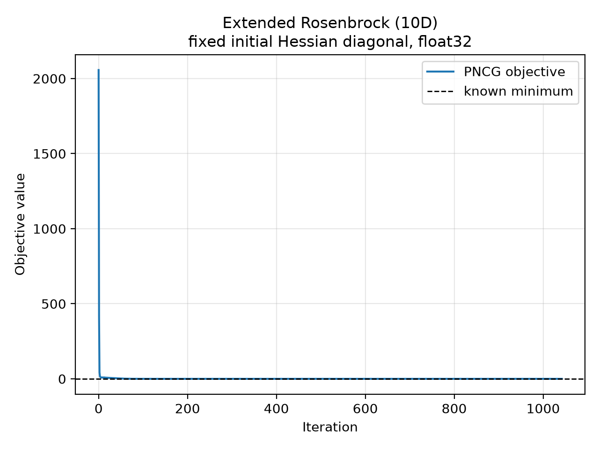 |

### Powell singular (4D)

| float64 | float32 |
|---|---|
| 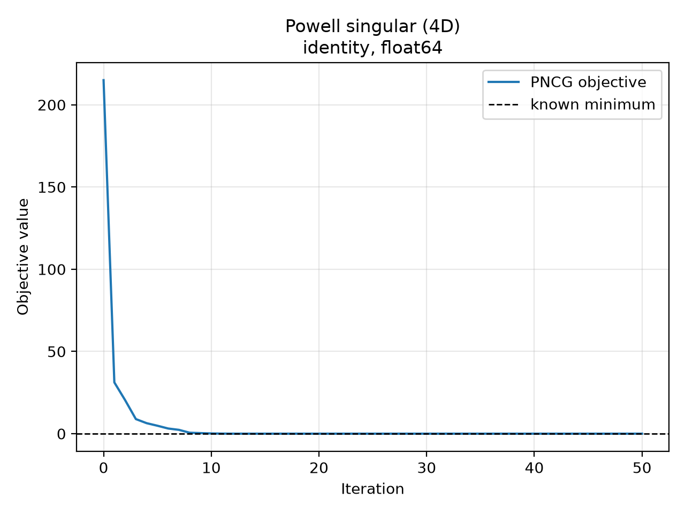 |  |

### Beale (2D)

| float64 | float32 |
|---|---|
| 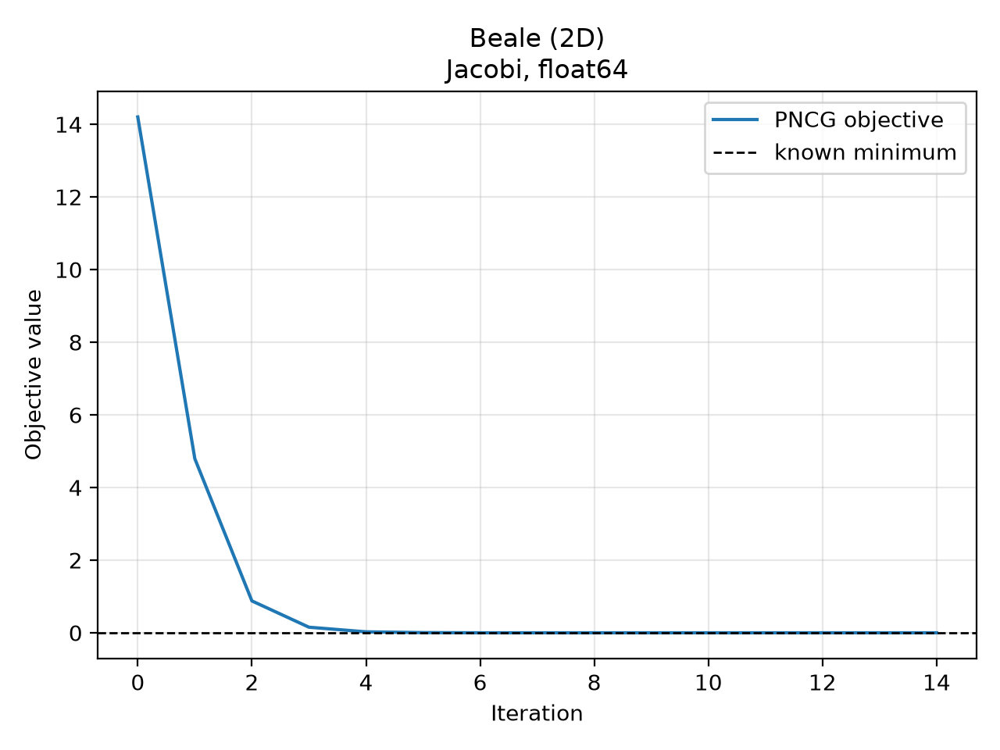 | 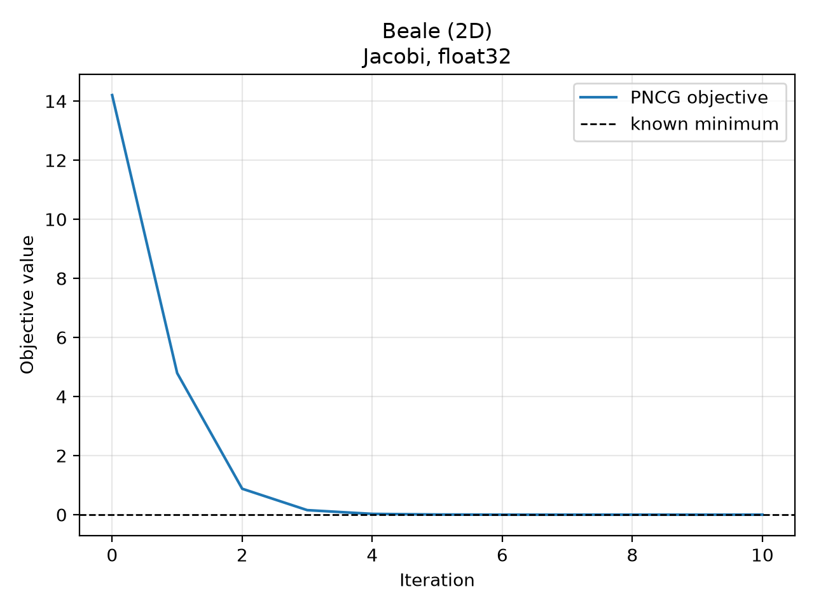 |

### Wood (4D)

| float64 | float32 |
|---|---|
| 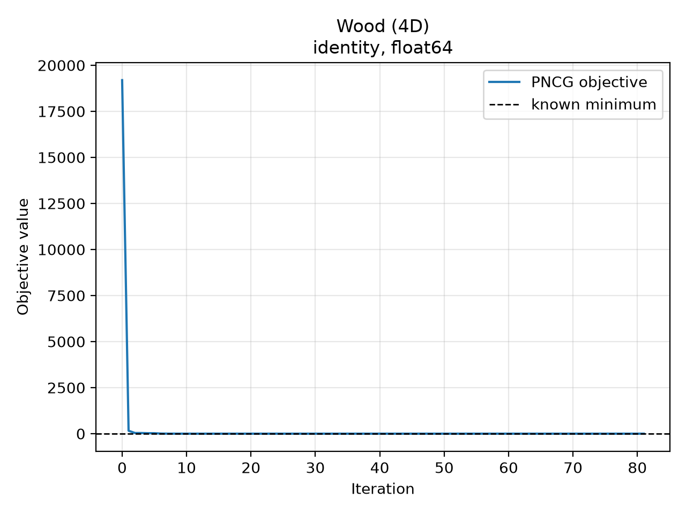 | 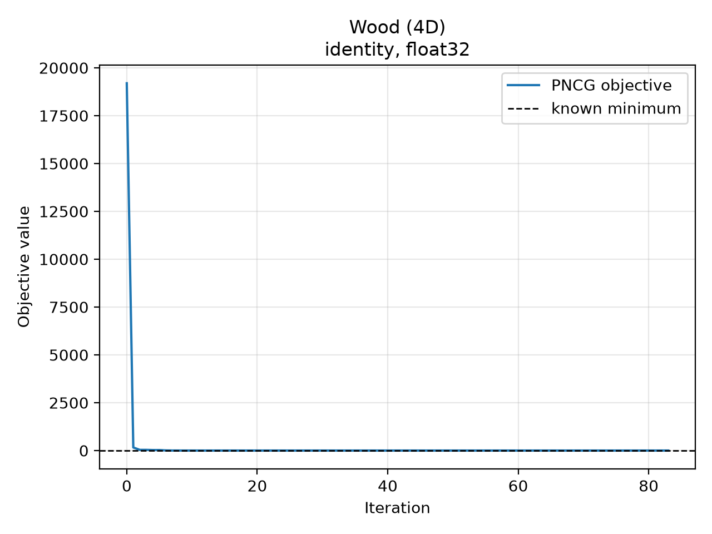 |

### Freudenstein–Roth (2D)

| float64 | float32 |
|---|---|
| 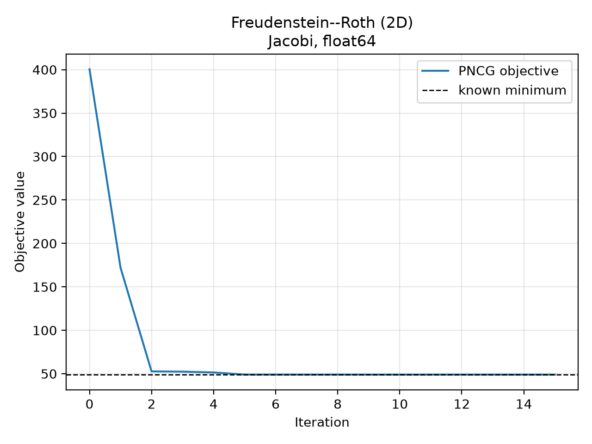 | 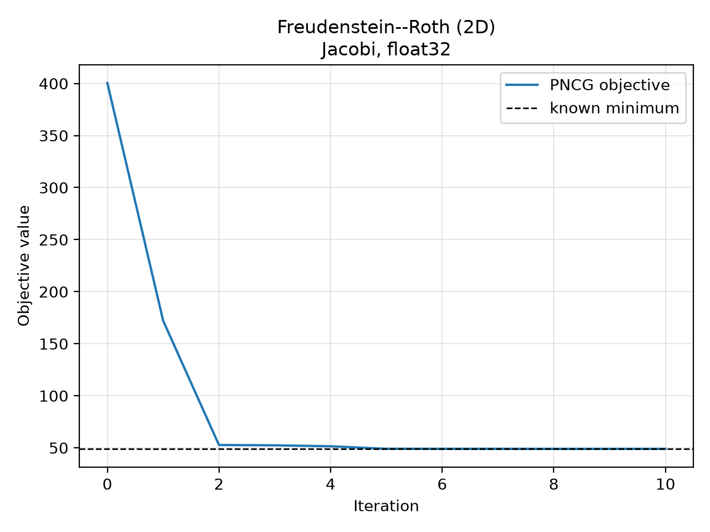 |

### Brown badly scaled (2D)

| float64 | float32 |
|---|---|
| 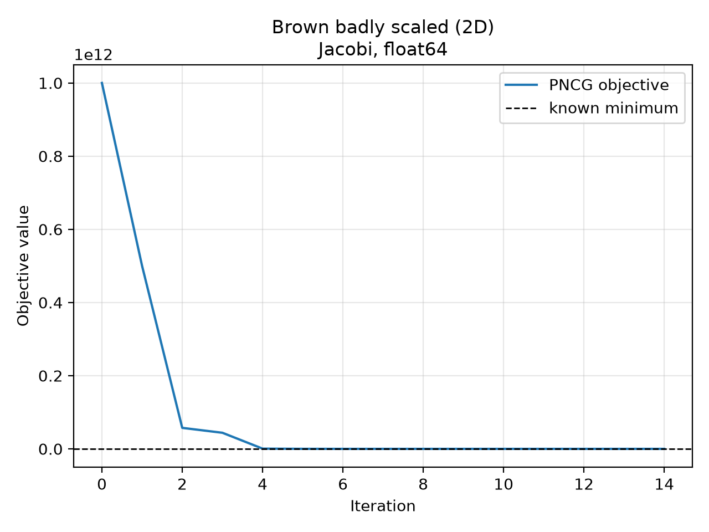 | 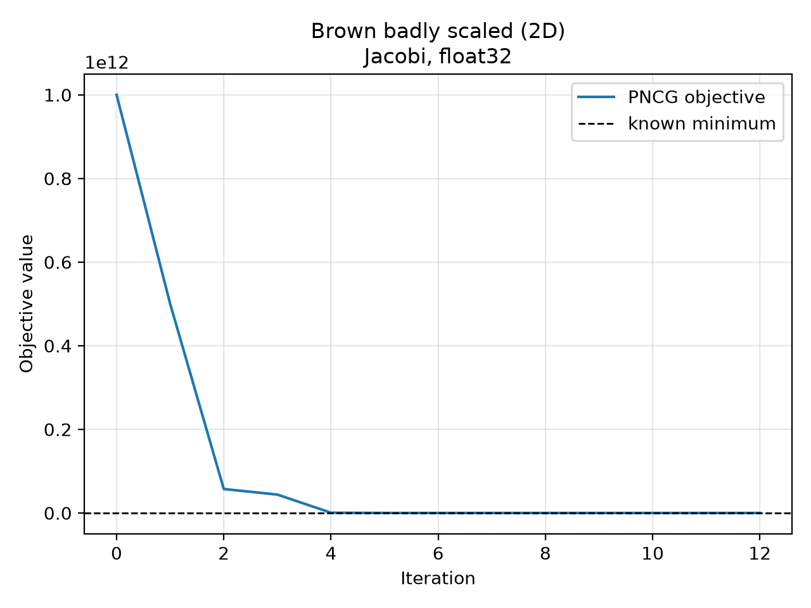 |

## 7. Verification

The implementation passed all 34 supplied tests. The benchmark driver also
passed Ruff formatting and lint checks. Complete raw benchmark tables are
available in `benchmark-results/float64.txt` and
`benchmark-results/float32.txt`, and the CSV file beside each plot contains the
underlying iteration, objective, objective-gap, and gradient-norm history.


**AI Usage Note**: ChatGPT Sol 5.6 was used to compose this writeup after running the tests and producing graphs. 