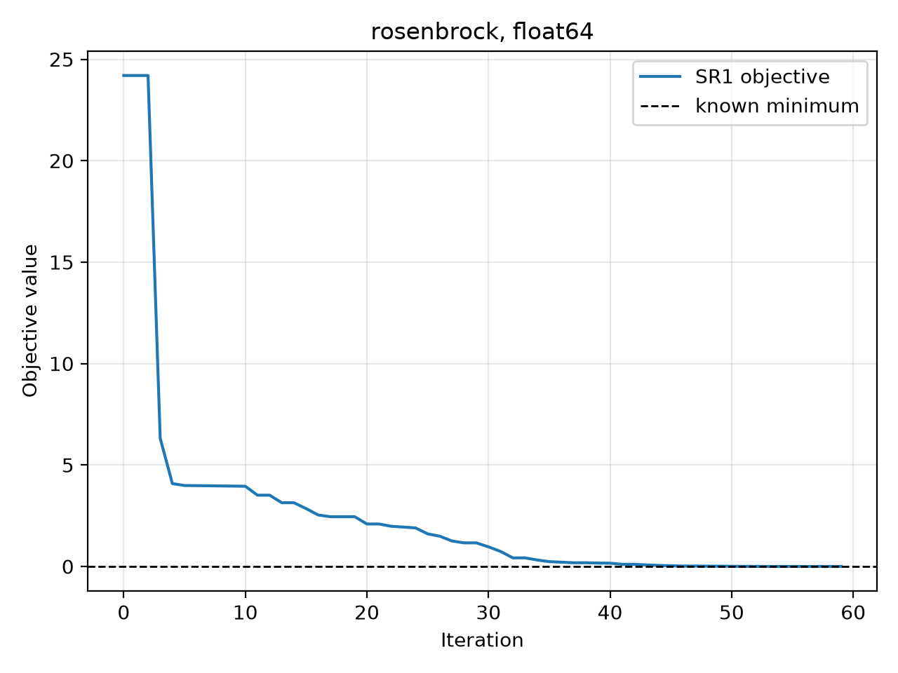
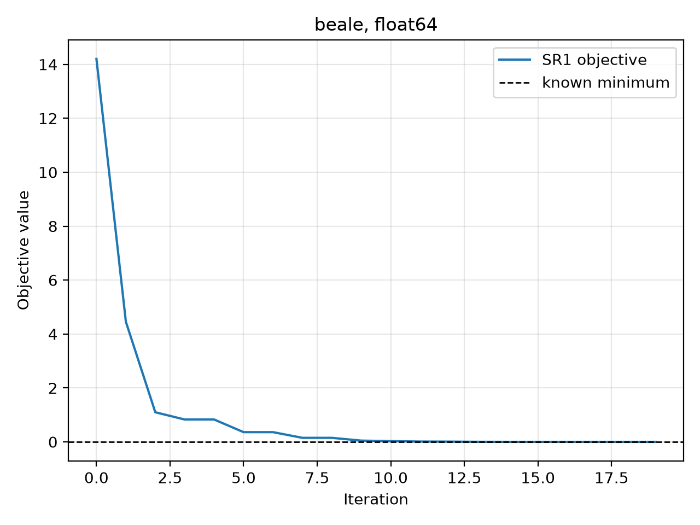
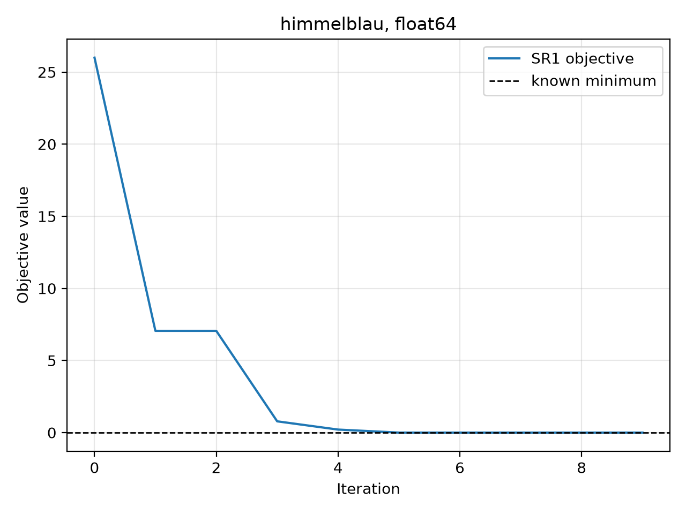
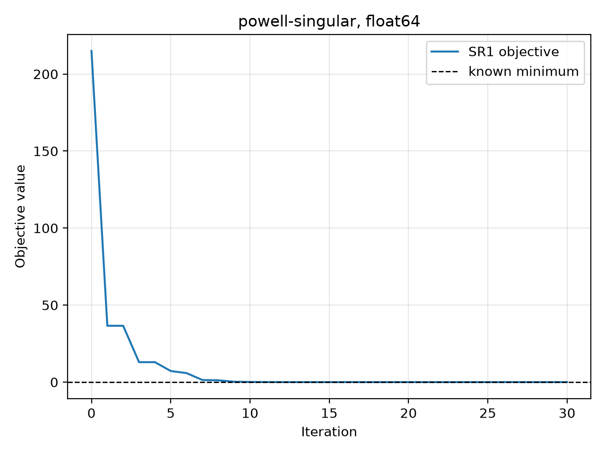
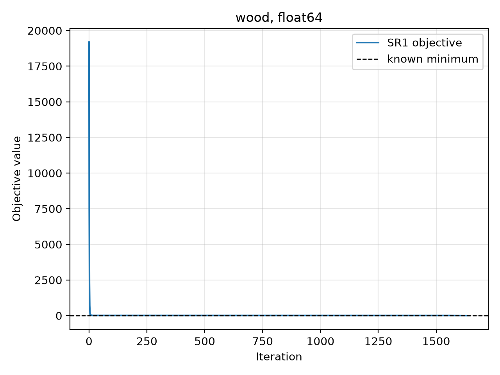
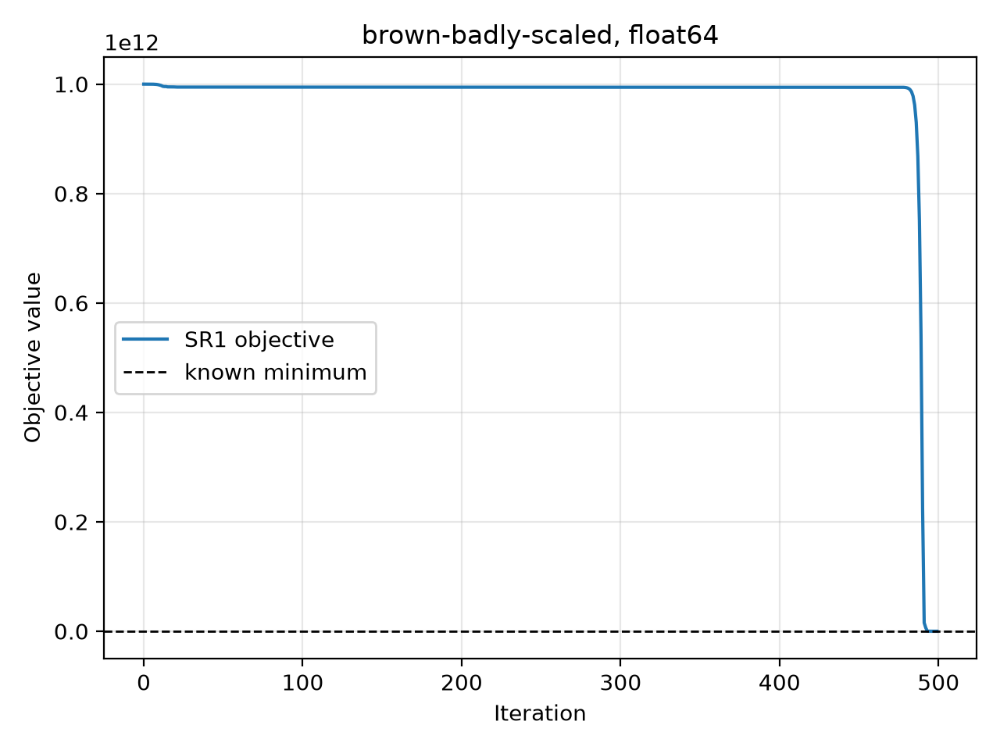
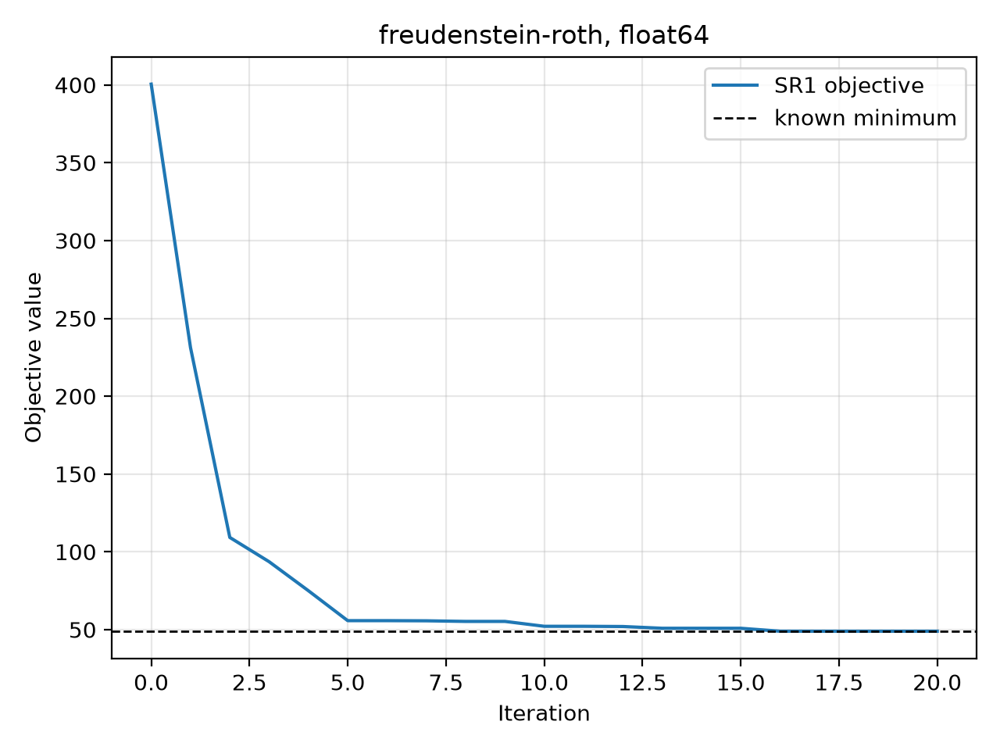

# Trust-Region SR1

## Method

The solver minimizes a local quadratic model at every outer iteration,

$$
q_k(s)=g_k^Ts+\frac{1}{2}s^TB_ks,
\qquad \lVert s\rVert\leq\Delta_k,
$$

where $g_k$ is the current gradient, $B_k$ is the SR1 Hessian approximation,
and $\Delta_k$ is the trust-region radius. The trial step is accepted or
rejected using the ratio

$$
\rho_k=
\frac{f(x_k)-f(x_k+s_k)}{q_k(0)-q_k(s_k)}.
$$

A large positive ratio means that the quadratic model predicted the real
objective reduction well. The algorithm uses this ratio to accept the step and
to expand, retain, or shrink the trust-region radius.

The implemented subproblem routine uses the dogleg construction when $B_k$ is
positive definite. A Cholesky factorization is used to test positive
definiteness and compute the full quasi-Newton step

$$
s_B=-B_k^{-1}g_k.
$$

If $s_B$ lies inside the trust region, it is returned directly. Otherwise, the
routine follows the dogleg path from the Cauchy point toward $s_B$ and returns
the intersection with the trust-region boundary. The Cauchy point minimizes
the model along the negative-gradient direction:

$$
s_C=-\tau g_k,
\qquad
\tau=
\min\left(
\frac{g_k^Tg_k}{g_k^TB_kg_k},
\frac{\Delta_k}{\lVert g_k\rVert}
\right)
$$

when $g_k^TB_kg_k>0$. If the directional curvature is nonpositive, the step
continues along $-g_k$ to the trust-region boundary. Because an SR1 matrix may
legitimately be indefinite, an indefinite $B_k$ produces this safe Cauchy step
instead of being treated as a solver error.

The supplied outer solver updates $B_k$ using the safeguarded SR1 formula. For
$s_k=x_{k+1}-x_k$, $y_k=g_{k+1}-g_k$, and
$r_k=y_k-B_ks_k$, the update is

$$
B_{k+1}=B_k+\frac{r_kr_k^T}{r_k^Ts_k},
$$

provided that the denominator passes the safeguard. Unlike BFGS, SR1 does not
force the approximation to stay positive definite, which is why the
indefinite-model fallback in the subproblem solver is needed.

## Experiment

I ran all seven supplied problems on the CPU using float64 and their supplied
starting points, iteration limits, and gradient tolerances. The command was

```bash
.venv/bin/python -m trsr1 --platform cpu --precision 64 \
  --plot-directory benchmark-results/float64/convergence
```

The environment used JAX 0.11.2. The complete test suite also passed: **30
tests passed**. These tests cover interior and boundary dogleg steps,
indefinite Cauchy steps, invalid inputs, JIT compilation, `vmap`, SR1 updates,
and the standard problem suite.

## Results

| Problem | Iterations | Final objective | Final $\lVert g\rVert_2$ | SR1 updates | Result |
|---|---:|---:|---:|---:|---|
| Rosenbrock | 59 | 3.9391e-18 | 2.1907e-08 | 59 | Converged |
| Beale | 19 | 7.4822e-18 | 6.1652e-09 | 19 | Converged |
| Himmelblau | 9 | 3.9068e-23 | 8.0663e-11 | 9 | Converged |
| Powell singular | 30 | 1.5338e-11 | 6.2065e-08 | 30 | Converged |
| Wood | 1643 | 7.6090e-18 | 8.3052e-08 | 1643 | Converged |
| Brown badly scaled | 499 | 8.1909e-33 | 1.8101e-10 | 499 | Converged |
| Freudenstein–Roth | 20 | 4.8984e+01 | 3.6880e-08 | 20 | Converged |

Every supplied problem satisfied its gradient tolerance. Himmelblau, Beale,
Freudenstein–Roth, Powell singular, and Rosenbrock converged relatively
quickly. Wood took 1643 iterations; this is consistent with the assignment's
warning that its convergence pattern can depend on the JAX version. Brown
badly scaled took 499 iterations because its solution components and curvature
scales differ dramatically.

The Freudenstein–Roth result is also expected: the standard starting point
converges to the known local minimizer with objective approximately 48.9843,
rather than to an objective of zero.

## Convergence plots

The blue line is objective value versus outer SR1 iteration. The dashed line
shows the known objective at the relevant minimizer. Flat portions can occur
when a proposed trust-region step is rejected and the current point is kept.

| Rosenbrock | Beale |
|---|---|
|  |  |

| Himmelblau | Powell singular |
|---|---|
|  |  |

| Wood | Brown badly scaled |
|---|---|
|  |  |

### Freudenstein–Roth



The plots show monotonic nonincrease in the stored objective because rejected
trial steps do not replace the current iterate. Brown badly scaled stays near
its very large initial objective for much of the run before the trust-region
model finds a useful scale and the objective drops rapidly. Wood reduces its
objective sharply at the beginning but needs a long tail of smaller
improvements before meeting the gradient tolerance.

The raw terminal results are stored in `benchmark-results/float64.txt`. Each
plot also has a CSV file containing iteration, objective, objective gap, and
gradient norm, so the figures can be regenerated or restyled without rerunning
the optimizer.


AI Usage: ChatGPT Sol 5.6 was used to understand the problem and help and verify code for dogleg, cauchy point, valid solution logic. It was also used to help with the writeup to include charts and format the content. 