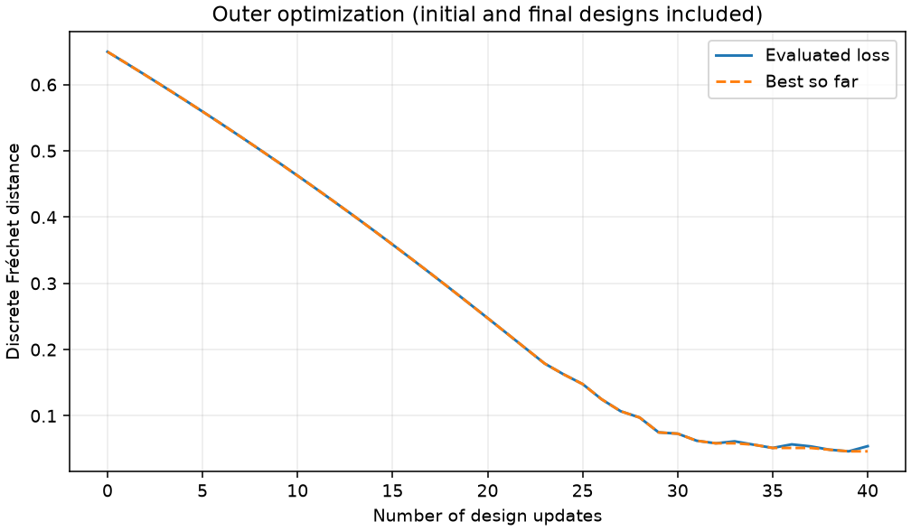
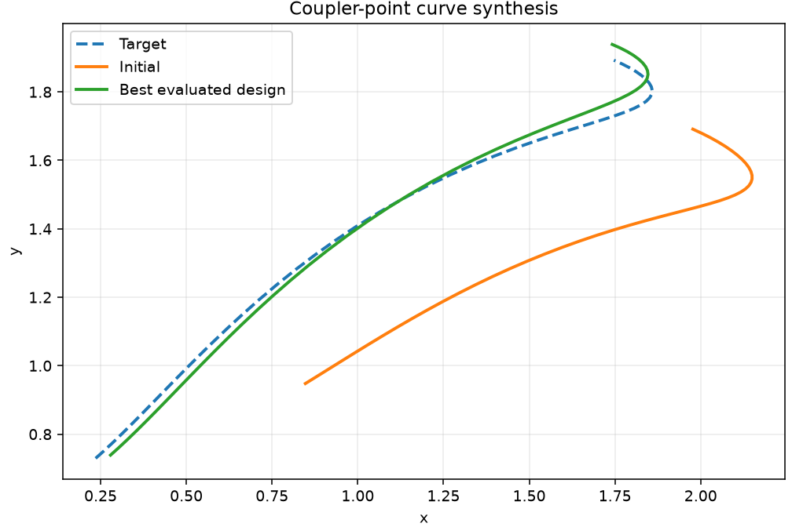
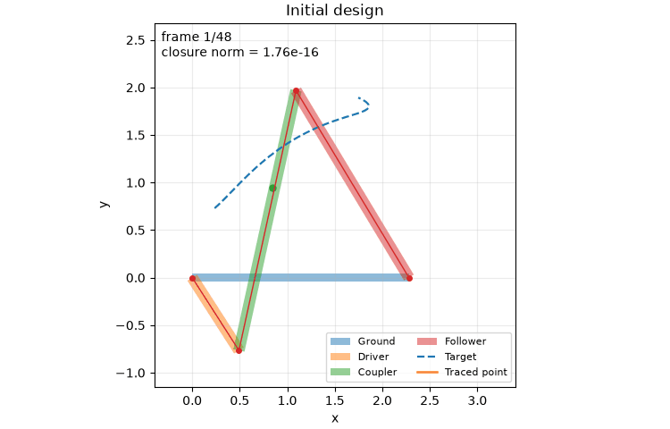
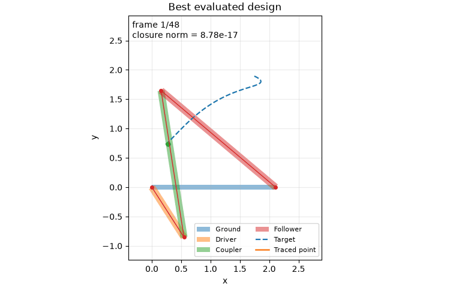

# Exercise 2.1 — Four-bar linkage

## Reproduce

- From the repository root (or extracted ZIP root):

```bash
cd hw2/Implementation/linkage
python3 -m venv .venv
source .venv/bin/activate
python -m pip install -r requirements-reproduce.txt
python checks.py --part all
python optimize.py --show
```

- Measured with **Python 3.14.3**, JAX 0.9.2, float64, CPU. Package versions are pinned in `requirements-reproduce.txt`.
- The saved run used `MPLBACKEND=Agg` to suppress desktop windows; omit it for interactive display. Numerical and animation settings remained at their defaults.
- The supplied folder lacked `checks.py`; the added **local verification harness** checks closure, finite-difference sensitivities/gradients, and projected updates. It is not an instructor test suite.

## Method and default parameters

- Joint closure: $E_t=\tfrac12\sum_{i=1}^3\|a_i-b_i\|_2^2$; Newton solves $\nabla_x E_t=0$.
- Implicit differentiation solves $H_t S_t=-B_t$, where $H_t=\partial_x\nabla_xE_t$, $B_t=\partial_\ell\nabla_xE_t$, and $S_t=\partial x_t^*/\partial\ell$.
- Total gradient: $dJ/d\ell=\partial_\ell J+\sum_t(\partial_{x_t}J)S_t$. Project active lengths after each gradient step onto $\ell_i\ge10^{-3}$.
- **40 updates**, step size **0.01**, all four lengths active; **48 driver angles** evenly spaced over **[−1,1] rad**.
- **8 Newton iterations/frame**, Newton damping **1e−8**, sensitivity damping **0**; assembly branch **+1**.
- Coupler point: center + **(0.35,0.02,0)** in local coordinates. Target generated using lengths **[2,1,2.5,2.5]**.
- Fixed ground width **0.09**, moving-link widths **0.12**, thickness **0**; left ground pin **(0,0,0)**, right pin **(ground length,0,0)**. Units are consistent model units.

## Before and after

| Parameter | Initial (0) | Best (39) | Final (40) |
|---|---:|---:|---:|
| Ground | 2.280000 | 2.108345 | 2.107329 |
| Driver | 0.910000 | 1.013542 | 1.012816 |
| Coupler | 2.800000 | 2.528153 | 2.531155 |
| Follower | 2.300000 | 2.551706 | 2.543868 |
| Discrete Fréchet objective | 0.649624 | 0.046388 | 0.054162 |

- **Best objective reduction: 92.86%**. “After” figures/animation show iteration **39**; the final update has a slightly higher loss. Fixed steps and the nonsmooth Fréchet objective need not give monotone improvement.
- All four local check groups passed; maximum finite-difference errors were **5.42e-10** for state sensitivities and **2.73e-10** for total gradients. The gradient check also exercises a length-dependent endpoint.
- Best design: maximum closure diagnostic **6.85e-16**, stationarity norm **1.38e-15**, sampled feasibility margin **1.071693**. Checks apply to the sampled angles; no global optimality claim.

## Images and animations

- **Objective versus outer iteration:** iteration 0 is the initial design; 40 is the final design.



- **Target, initial path, and best path:** optimization brings the traced coupler curve close to the target.



- **Before:** 48-frame driver sweep, looping GIF at 12 fps.



- **After (best design, iteration 39):**



- Exact parameters and diagnostics: `outputs/optimization/summary.json`; all 41 evaluated designs: `history.csv`; states and curves: `results.npz`. Console evidence: `checks.log` and `optimization.log`, in the same output folder.

### AI Usage
Used ChatGPT 6.1 Sol to format this file and run the simulation